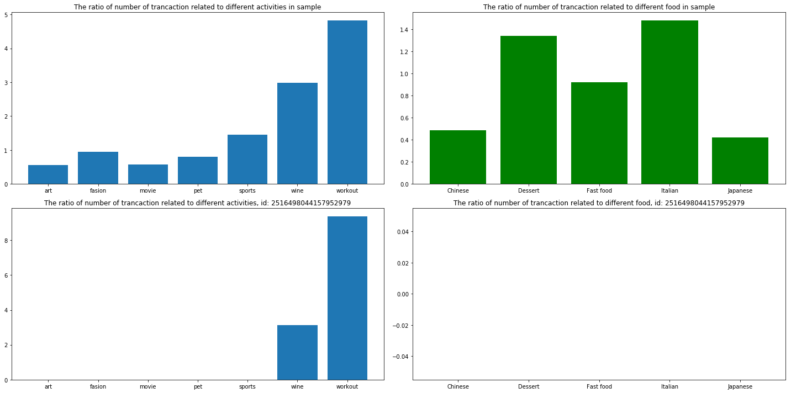
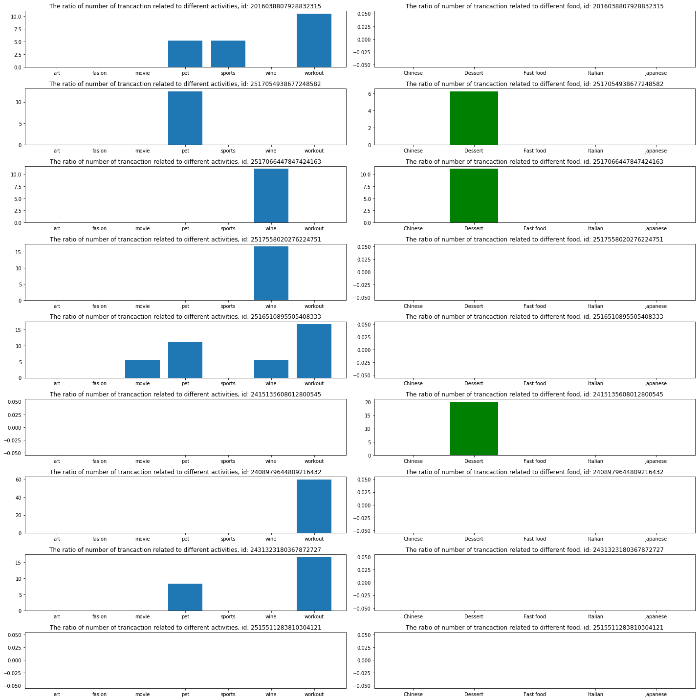

```python
% matplotlib inline
import bson
import pandas as pd
from collections import Counter
import matplotlib.pyplot as plt
```


```python
# import data. data size is larger than 10GB, load 3,000,000 for test
data = bson.decode_file_iter(open('venmo.bson', 'rb'))
#data_sample = list(islice(data, 3))
target = []
actor = []
action = []
note = []
for c, d in enumerate(data):
        try:
            target.append(d['payment']['target']['user'])
            actor.append(d['payment']['actor'])
            note.append(d['payment']['note'])
            action.append(d['payment']['action'])
        except TypeError:
            print(c)
        if c == 3000000:
            break

#         target.append(d['payment']['target']['user'])
#         actor.append(d['payment']['actor'])
#         note.append(d['payment']['note'])

    #category_id = d['payment'] # This won't be in Test data
    #prod_to_category[product_id] = category_id
```

    2303408


```python
target_nn = []
actor_nn = []
note_nn = []
action_nn = []
for ii in range(len(target)):
    if target[ii] != None and actor[ii] != None and note[ii] != None and action[ii] != None: 
        target_nn.append(target[ii])
        actor_nn.append(actor[ii])
        note_nn.append(note[ii])
        action_nn.append(action[ii])
#len(target)
```


```python
df = pd.DataFrame(target_nn)
df.head()
```


<div>
<style scoped>
    .dataframe tbody tr th:only-of-type {
        vertical-align: middle;
    }

    .dataframe tbody tr th {
        vertical-align: top;
    }

    .dataframe thead th {
        text-align: right;
    }
</style>
<table border="1" class="dataframe">
  <thead>
    <tr style="text-align: right;">
      <th></th>
      <th>about</th>
      <th>date_joined</th>
      <th>display_name</th>
      <th>email</th>
      <th>first_name</th>
      <th>friend_status</th>
      <th>friends_count</th>
      <th>id</th>
      <th>identity</th>
      <th>is_active</th>
      <th>is_blocked</th>
      <th>is_group</th>
      <th>last_name</th>
      <th>phone</th>
      <th>profile_picture_url</th>
      <th>trust_request</th>
      <th>username</th>
    </tr>
  </thead>
  <tbody>
    <tr>
      <th>0</th>
      <td></td>
      <td>2016-11-13 07:09:48</td>
      <td>Sion Kim</td>
      <td>None</td>
      <td>Sion</td>
      <td>None</td>
      <td>None</td>
      <td>2082497001160704615</td>
      <td>None</td>
      <td>True</td>
      <td>False</td>
      <td>False</td>
      <td>Kim</td>
      <td>None</td>
      <td>https://venmopics.appspot.com/u/v5/s/19950034-...</td>
      <td>None</td>
      <td>kimsionie</td>
    </tr>
    <tr>
      <th>1</th>
      <td></td>
      <td>2017-01-13 01:23:54</td>
      <td>Francisco Chavez</td>
      <td>None</td>
      <td>Francisco</td>
      <td>None</td>
      <td>None</td>
      <td>2126534223593472269</td>
      <td>None</td>
      <td>True</td>
      <td>False</td>
      <td>False</td>
      <td>Chavez</td>
      <td>None</td>
      <td>https://graph.facebook.com/v2.10/6439986791360...</td>
      <td>None</td>
      <td>Francisco-Chavez-17</td>
    </tr>
    <tr>
      <th>2</th>
      <td></td>
      <td>2018-08-04 18:45:48</td>
      <td>Kari Joel</td>
      <td>None</td>
      <td>Kari</td>
      <td>None</td>
      <td>None</td>
      <td>2538731244355584742</td>
      <td>None</td>
      <td>True</td>
      <td>False</td>
      <td>False</td>
      <td>Joel</td>
      <td>None</td>
      <td>https://s3.amazonaws.com/venmo/no-image.gif</td>
      <td>None</td>
      <td>Kari-Joel-1</td>
    </tr>
    <tr>
      <th>3</th>
      <td></td>
      <td>2017-09-07 00:05:48</td>
      <td>Rachel McClennen</td>
      <td>None</td>
      <td>Rachel</td>
      <td>None</td>
      <td>None</td>
      <td>2298266762870784858</td>
      <td>None</td>
      <td>True</td>
      <td>False</td>
      <td>False</td>
      <td>McClennen</td>
      <td>None</td>
      <td>https://graph.facebook.com/v2.10/1931955430164...</td>
      <td>None</td>
      <td>Rachel-McClennen</td>
    </tr>
    <tr>
      <th>4</th>
      <td></td>
      <td>2016-04-04 21:51:04</td>
      <td>Jessie Rankin</td>
      <td>None</td>
      <td>Jessie</td>
      <td>None</td>
      <td>None</td>
      <td>1921315569139712500</td>
      <td>None</td>
      <td>True</td>
      <td>False</td>
      <td>False</td>
      <td>Rankin</td>
      <td>None</td>
      <td>https://venmopics.appspot.com/u/v1/s/e488ecad-...</td>
      <td>None</td>
      <td>JDR88</td>
    </tr>
  </tbody>
</table>
</div>


```python
df_target = df.drop(['about', 'date_joined', 'email', 'identity',
                     'is_active', 'is_blocked', 'is_group', 'display_name',
                     'phone', 'profile_picture_url', 'trust_request'], axis = 1)
```


```python
df_target.to_csv('target.csv')
```


```python
df_actor = pd.DataFrame(actor_nn).drop(['about', 'date_joined', 'email', 'identity',
                                        'is_active', 'is_blocked', 'is_group', 'display_name',
                                        'phone', 'profile_picture_url', 'trust_request'], axis = 1)
df_actor.to_csv('actor.csv')
```


```python
df_note = pd.DataFrame(note_nn)
df_note.to_csv('note.csv')
```


```python
df_action = pd.DataFrame(action_nn)
df_action.to_csv('action.csv')
```


```python
# df_note = pd.read_csv('note.csv')
# df_target =  pd.read_csv('target.csv')
# df_actor = pd.read_csv('actor.csv')
# df_note.drop('Unnamed: 0', axis = 1, inplace = True)
# df_target.drop('Unnamed: 0', axis = 1, inplace = True)
# df_actor.drop('Unnamed: 0', axis = 1, inplace = True)
```


```python
sample = df_actor.join(df_target, lsuffix='_actor', rsuffix='_target')
sample['note'] = df_note
sample['action'] = df_action
sample.head()
```


<div>
<style scoped>
    .dataframe tbody tr th:only-of-type {
        vertical-align: middle;
    }

    .dataframe tbody tr th {
        vertical-align: top;
    }

    .dataframe thead th {
        text-align: right;
    }
</style>
<table border="1" class="dataframe">
  <thead>
    <tr style="text-align: right;">
      <th></th>
      <th>first_name_actor</th>
      <th>friend_status_actor</th>
      <th>friends_count_actor</th>
      <th>id_actor</th>
      <th>last_name_actor</th>
      <th>username_actor</th>
      <th>first_name_target</th>
      <th>friend_status_target</th>
      <th>friends_count_target</th>
      <th>id_target</th>
      <th>last_name_target</th>
      <th>username_target</th>
      <th>note</th>
      <th>action</th>
    </tr>
  </thead>
  <tbody>
    <tr>
      <th>0</th>
      <td>Vitna</td>
      <td>None</td>
      <td>None</td>
      <td>2482900494712832556</td>
      <td>Kim</td>
      <td>Vitna-Kim</td>
      <td>Sion</td>
      <td>None</td>
      <td>None</td>
      <td>2082497001160704615</td>
      <td>Kim</td>
      <td>kimsionie</td>
      <td>fuk ya</td>
      <td>pay</td>
    </tr>
    <tr>
      <th>1</th>
      <td>Jesus</td>
      <td>None</td>
      <td>None</td>
      <td>2457721903251456771</td>
      <td>Chavez</td>
      <td>mekanik915</td>
      <td>Francisco</td>
      <td>None</td>
      <td>None</td>
      <td>2126534223593472269</td>
      <td>Chavez</td>
      <td>Francisco-Chavez-17</td>
      <td>🚗</td>
      <td>pay</td>
    </tr>
    <tr>
      <th>2</th>
      <td>Brian</td>
      <td>None</td>
      <td>None</td>
      <td>2363395470786560486</td>
      <td>Joel</td>
      <td>Brian-Joel-1</td>
      <td>Kari</td>
      <td>None</td>
      <td>None</td>
      <td>2538731244355584742</td>
      <td>Joel</td>
      <td>Kari-Joel-1</td>
      <td>:venmo_dollar:</td>
      <td>pay</td>
    </tr>
    <tr>
      <th>3</th>
      <td>Mike</td>
      <td>None</td>
      <td>None</td>
      <td>1988829997170688939</td>
      <td>Inglese</td>
      <td>mikeinglese</td>
      <td>Rachel</td>
      <td>None</td>
      <td>None</td>
      <td>2298266762870784858</td>
      <td>McClennen</td>
      <td>Rachel-McClennen</td>
      <td>Gatorade</td>
      <td>pay</td>
    </tr>
    <tr>
      <th>4</th>
      <td>Savannah</td>
      <td>None</td>
      <td>None</td>
      <td>2278060275531776951</td>
      <td>Landry</td>
      <td>Savannah-Landry-4</td>
      <td>Jessie</td>
      <td>None</td>
      <td>None</td>
      <td>1921315569139712500</td>
      <td>Rankin</td>
      <td>JDR88</td>
      <td>🎉</td>
      <td>pay</td>
    </tr>
  </tbody>
</table>
</div>


```python
sample['note'] = sample['note'].fillna('0')
sample['note'] = sample['note'].apply(lambda x: x.lower())
```


```python
# sort user based on number of record
aa = sample['note'].groupby(sample['id_actor'])
aa.count().sort_values(ascending = False)
```


    id_actor
    2135126842540032910    113
    1997633002405888173    105
    2330070962143232368     90
    2411768840192000987     61
    2236412472590336483     47
    1874509636304896473     43
    2296571853012992156     41
    1271828970471424398     39
    1445702903267328221     38
    1495279341666304636     34
    2407072335396864571     34
    2516498044157952979     32
    1228423024345088846     29
    1900224628916224744     28
    1776289950203904358     28
    1832026067959808677     27
    1509042035884032508     26
    2337822597971968392     25
    2560590799175680562     25
    1612702245978112263     25
    2295206548340736949     25
    2449608751972352952     23
    1976426710433792824     23
    2072298718756864485     23
    1603208011055104145     23
    2496110555824128669     23
    2056720855597056301     23
    1798293059272704804     23
    2328596773339136233     23
    1495639548493824822     23
                          ... 
    2214970284572672647      1
    2214964513210368447      1
    2214964555153408313      1
    2214964764868608917      1
    2214964798423040609      1
    2214964857143296218      1
    2214965855387648331      1
    2214967172399104231      1
    2214967440834560792      1
    2214967658938368755      1
    2214968590073856156      1
    2214968766234624977      1
    2214969537986560660      1
    2214969999360000568      1
    2214971375091712177      1
    2214975191908352009      1
    2214971492532224255      1
    2214972197175296396      1
    2214972415279104544      1
    2214972524331008223      1
    2214972767600640826      1
    2214973807788032526      1
    2214973916839937011      1
    2214973950394368091      1
    2214974176886784033      1
    2214974529208320976      1
    2214974596317184846      1
    2214974822809600840      1
    2214975175131136066      1
    1000013232603136694      1
    Name: note, Length: 2326216, dtype: int64


```python
# check subsring
def ContainAny(seq, aset):
    for item in filter(aset.__contains__,seq):       
            return True
    return False
```


```python
# check notes contains only image
alpha = 'abcdefghijklmnopqrstuvwxyz'
num = '0123456789'
img = []
count = 1
for ii in sample['note']:
    if not ContainAny(ii, num + alpha):
        #print(ii)
        img += ii
        count += 1
img_count = Counter(img)
```


```python
petimg = '🐕🐱🐈🐶🐾😺🐯🐦🐤🐇🐩'
wineimg = '🍹🥃🍶🍷🍺🍸🍻🥂🍾'
artimg = '🎼🎶🎵🎹🥁🎧🎸🎻🖍📸🎨'
fasionimg = '💅👗👖💄👠👔👟👜👞👚👕👢💄🎽💇🛍💅'
movieimg = '📽🎞📷🎬📹🎥🍿'
sportsimg = '🎳⛸🏄🏊⛷🏈🎿⛹🏏🤼💃🏐🏉🏂⚽🥋🏀🥊🏒🎾🏓🏇🛶🤾🏸🏑🚣🏌'
workoutimg = '💪🏻💪🏃🤸🏃‍♀️🏋'
transimg = '🚒🛫🛩🚕🚌🚇🚅🚚✈🚜🚍🚎🚙🚲🚗🚃🚐🚘🚔🚑🚂🚓⛽'
fastfoodimg = '🍔🌭🍟'
japfoodimg = '🍙🍣'
chifoodimg = '🍜🥟🍲'
italfoodimg = '🍕'
dessertimg = '🍨🍮🍰🍪🍡🍬🎂🥐🥨🍫🍩🧀🍧'
```


```python
# count for different catagories
def count_key(keyword, keyimg, sample):
    count = 0
    for ii in sample:
        if keyword[0] in ii or keyword[1] in ii or keyword[2] in ii or keyword[3] in ii:
            count += 1
        if keyimg != None:
            if not ContainAny(ii, num + alpha) and ContainAny(ii, keyimg):
                count += 1
    return count
```


```python
# count for different activities
def count_act(sample):
    art_count = count_key(['music', 'concert', 'piano', 'painting'], artimg, sample)
    paint_count = count_key([' drawing', ' painting', ' coloring', 'pigment'], None, sample)
    #paint_ratio = paint_count/len(sample) * 100
    art_count += paint_count
    art_ratio = art_count/len(sample) * 100
    
    pet_count = count_key([' pet ', ' cat', 'dog', ' vet '], petimg, sample)
    pet_ratio = pet_count/len(sample) * 100
    
    drink_count = count_key(['wine', 'beer', 'whiskey', 'vodka'], drinkimg, sample)
    drink_ratio = drink_count/len(sample) * 100

    fasion_count = count_key(['clothes', 'shoes', 'shopping', 'style'], styleimg, sample)
    fasion_ratio = fasion_count/len(sample) * 100
    
    movie_count = count_key(['movie', 'film', 'netflix', 'theater'], movieimg, sample)
    movie_ratio = movie_count/len(sample) * 100
    
    sports_count = count_key(['sport', 'baseball', 'swim', 'volleyball'], sportsimg, sample)
    sports_ratio = sports_count/len(sample) * 100

    workout_count = count_key(['fitness', 'gym', 'yoga', 'training'], workoutimg, sample)
    workout_ratio = workout_count/len(sample) * 100

    activity = ['art', 'pet', 'wine', 'fasion', 'movie', 'sports', 'workout']
    act_ratio = [art_ratio, pet_ratio, drink_ratio, fasion_ratio, movie_ratio, sports_ratio, workout_ratio]
#trans_count = count_key(['transportation', 'uber', ' lyft', ' bus '], transimg, sample['note'])
#trans_ratio = trans_count/len(sample) * 100
    return activity, act_ratio


```


```python
# count for different type of food
def count_food(sample):
    fastfood_count = count_key(['fries', 'burger', 'sandwich', 'hotdog'], fastfoodimg, sample)
    fastfood_ratio = fastfood_count/len(sample) * 100
    japfood_count = count_key(['ramen', 'sushi', 'japanese', 'shabu'], japfoodimg, sample)
    japfood_ratio = japfood_count/len(sample) * 100
    chifood_count = count_key(['panda', 'noodle', 'chinese', 'dumpling'], chifoodimg, sample)
    chifood_ratio = chifood_count/len(sample) * 100
    italfood_count = count_key(['pizza', 'pasta', 'italian', 'risotto'], italfoodimg, sample)
    italfood_ratio = italfood_count/len(sample) * 100
    dessert_count = count_key(['chocolate', 'ice cream', 'cake', 'cooki'], dessertimg, sample)
    dessert_ratio = dessert_count/len(sample) * 100
    food_type = ['Fast food', 'Japanese', 'Chinese', 'Italian', 'Dessert']
    food_ratio = [fastfood_ratio, japfood_ratio, chifood_ratio, italfood_ratio, dessert_ratio]

    return food_type, food_ratio

```


```python
dff.note.head(40)
```


    Series([], Name: note, dtype: object)


```python
# plot the activity feature and food feature for sample
activity, act_ratio = count_act(sample['note'])
food_type, food_ratio = count_food(sample['note'])

fig1, axe = plt.subplots(2,2, figsize=(20,10))
axe[0,0].bar(activity, act_ratio)
axe[0,0].set_title('The ratio of number of trancaction related to different activities in sample')
axe[0,1].bar(food_type, food_ratio, color = 'g')
axe[0,1].set_title('The ratio of number of trancaction related to different food in sample')
plt.tight_layout()

# plot the activity feature and food feature for user with id = id_person
# 2516498044157952979     32
# 1228423024345088846     29
# 1900224628916224744     28
# 1776289950203904358     28
# 1832026067959808677     27
# 1509042035884032508     26
# 2337822597971968392     25
# 2560590799175680562     25
# 1612702245978112263     25
# 2295206548340736949     25
# 2449608751972352952     23
# 1976426710433792824     23
# 2072298718756864485     23
# 1603208011055104145     23
# 2496110555824128669     23
# 2056720855597056301     23
# 1798293059272704804     23
# 2328596773339136233     23
# 1495639548493824822     23

id_person = '2516498044157952979'
#2516498044157952979
#2337822597971968392
dff = sample[sample['id_actor'] == id_person]
activity, act_ratio = count_act(dff['note'])
food_type, food_ratio = count_food(dff['note'])

axe[1,0].bar(activity, act_ratio)
axe[1,0].set_title('The ratio of number of trancaction related to different activities, id: ' + id_person)
axe[1,1].bar(food_type, food_ratio, color = 'g')
axe[1,1].set_title('The ratio of number of trancaction related to different food, id: ' + id_person)
plt.tight_layout()
```





```python
# find user's connection
dff_connet_id = dff['id_target'].unique()
#dff_connet_id[2]
dff_connect = sample[sample["id_target"] == dff_connet_id[0]]
dff_connect['note'].head(20)
```


    6859                       🤦🏼‍♀️
    216132                         🤳
    337303     mother knows best 😂😂😂
    466031                         🕌
    618960                         🤩
    650199                        :🍭
    779846                         🍽
    1391723                       🔆🔆
    2360312                        🐶
    2367898                        🥤
    2415892                        🚗
    2464911        :rocket_popsicle:
    2495530        :rocket_popsicle:
    2622943                        🤞
    2647985        :rocket_popsicle:
    2670011                        😅
    2789064                        🛶
    2789432        :festival_floaty:
    2812883                     :✂️🎁
    Name: note, dtype: object


```python
# plot connection's activity and food feature
figc, axec = plt.subplots(len(dff_connet_id),2, figsize=(20,20))

for ii in range(len(dff_connet_id)):
    dff_connect = sample[sample["id_target"] == dff_connet_id[ii]]
    activity, act_ratio = count_act(dff_connect['note'])
    food_type, food_ratio = count_food(dff_connect['note'])

    axec[ii, 0].bar(activity, act_ratio)
    axec[ii, 0].set_title('The ratio of number of trancaction related to different activities, id: ' + dff_connet_id[ii])
    axec[ii, 1].bar(food_type, food_ratio, color = 'g')
    axec[ii, 1].set_title('The ratio of number of trancaction related to different food, id: ' + dff_connet_id[ii])
    plt.tight_layout()
```




